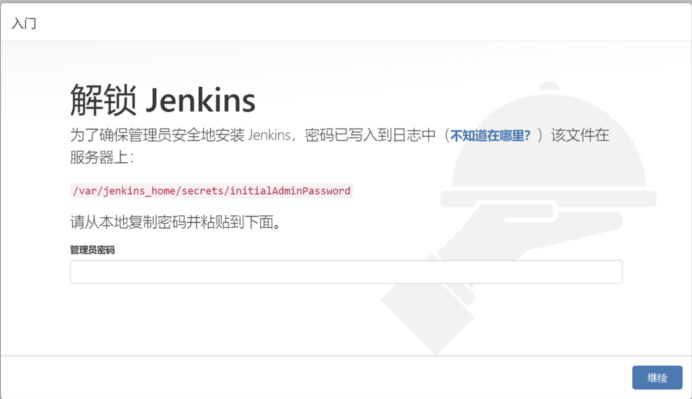
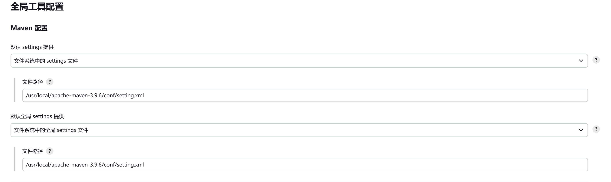
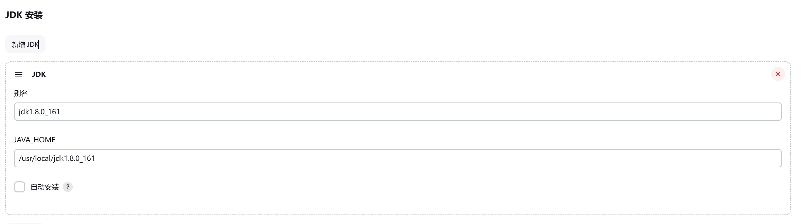

# jekins安装

## 启动完jekins后要看日志，获得秘密进行初始化使用

## 需要拷贝镜像仓库地址到容器中

docker cp ..\data\jenkins\hudson.model.UpdateCenter.xml jenkins:/var/jenkins_home/hudson.model.UpdateCenter.xml

[hudson.model.UpdateCenter.xml](hudson.model.UpdateCenter.xml)

## 除了推荐插件，需要额外安装的插件

1.NodeJs
2.SSH Pipeline Steps
3.Maven Integration

## 拷贝jdk到容器

docker cp D:/zyr/dev/jdk1.8.0_181 jenkins:/usr/local/jdk1.8.0_161

## 拷贝maven到容器

docker cp D:/zyr/dev/apache-maven-3.9.6 jenkins:/usr/local/apache-maven-3.9.6

## 配置jekins

